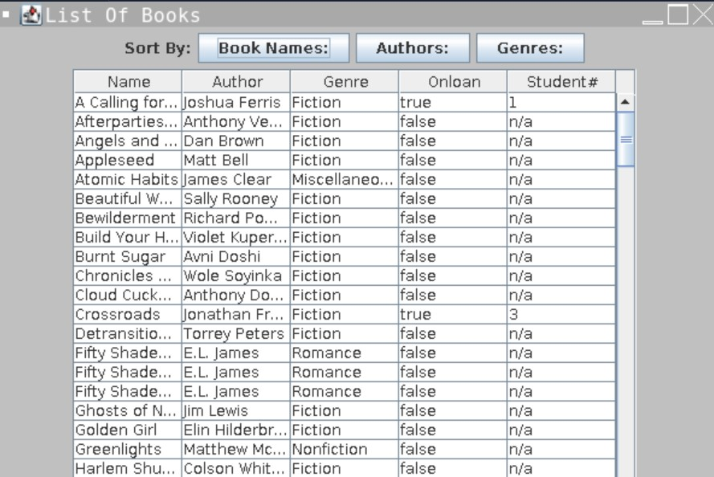

# Library-Management-System
A GUI that allows librarians to store and manage all the library records in a computerized database.

## Features

- **Book and Student Management**: Allows librarians to add, edit, and remove records of books and students.
- **GUI Interface**: Built with Java Swing, the GUI provides an intuitive and easy-to-navigate interface for users.
- **Sorting and Searching**: Implements selection sort and binary search algorithms to organize and retrieve records quickly.
- **Persistent Data Storage**: Uses file I/O to save and load data, ensuring that records persist between sessions.
- **Sorting Options**: Librarians can sort the book list by various attributes, such as title, author, and genre.

## Key Functionalities

1. **Add Records**: Add new book and student entries to the library database.
2. **Edit Records**: Update details for existing books and students.
3. **Remove Records**: Delete books and students from the database.
4. **Search Functionality**: Quickly locate records using binary search.
5. **Sorting Options**: Organize records with selection sort based on user-selected attributes.
6. **File Management**: Save records to a file and load them on program startup.

## Technologies Used

- **Java**: Main programming language used.
- **Java Swing**: For creating the GUI interface.
- **OOP Concepts**: Object-oriented programming principles are applied for modular code organization.
- **Algorithms**: Binary search for fast searching and selection sort for organizing data.
- **File I/O**: For saving and loading library data to and from files.

## How to Use

1. **Start the Program**: Run the Java application. The GUI will open, displaying the list of books and students.
2. **Add a Book/Student**: Use the "Add" button to enter details of a new book or student.
3. **Edit Details**: Select a record from the list and choose "Edit" to modify its information.
4. **Remove a Record**: Select a record and choose "Remove" to delete it from the database.
5. **Search and Sort**: Use the search box and sorting dropdowns to find and organize records quickly.
